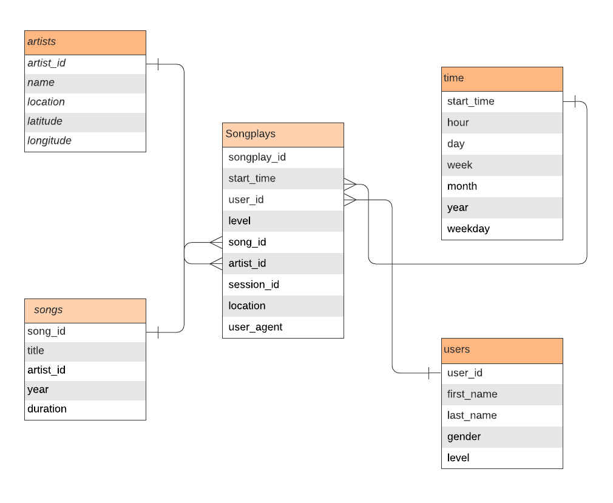
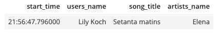
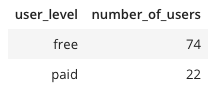

# The Sparkify database
The purpose of Sparkify database is to provide data to the analytics team at Sparkify in a format that helps them analyze and understand Sparkify's music streaming data. 

# Database Schema Design

Sparkify database consists of one fact table and four dimension tables that describe attributes of the fact table. The fact table **songplays** stores log data associating a user, song, artist and the time of the logged event. Dimensions users, songs, artists and time describe the fact as follows:

    1. users - users of the app
    2. songs - songs in music database
    3. artists - artists in music database
    4. time - timestamp of log events broken down by specific units of time
    
## Sparkify ERD

# ETL Pipeline

The ETL pipeline is designed to load data into dimensions and fact tables. 
The first step in the ETL pipeline is to ensure song dataset (json files under data/song_data) are extracted, processed and loaded into **songs** dimension. From the same dataset, artist information is extracted and loaded into **artists** dimension table.

The second step is to extract and process log dataset (json files under data/log_data). Log timestamp is extracted from ts column and broken down into specific units of time before loading into the **time** dimension. 
Unique users of the app are then extracted and loaded into the **users** dimension. 

Once all the dimension tables are loaded, data for the fact table is prepared for loading. A lookup is performed on the songs and artists dimensions to extract song_id and artist_id by looking up the song title, artist name and duration of the song. All other relevant information is then merged together to load into the final **songplays** fact table.

# How to run the ETL pipeline

The test.ipynb notebook can be used to create tables, run the ETL pipeline to load data into the Sparikify star schema. Steps are as follows:

    1. Run create_tables.py - This file will drop and recreate all the tables.
    2. Run etl.py - This file will extract data from song and log datasets, and load into dimension and fact tables.

# How to use Sparkify database for analysis

The notebook test.ipynb can be used to run queries against the newly populated Sparkify database to understand and analyze music streaming data.

## Examples of analytical queries and results
#### 1. What songs are users listening to?
  <code> %sql SELECT sp.start_time,u.first_name||' '||u.last_name as users_name,\
     s.title as song_title,a.name as artists_name\
     FROM songplays sp\
     JOIN songs s ON sp.song_id=s.song_id\
     JOIN users u ON u.user_id=sp.user_id\
     JOIN artists a ON a.artist_id=sp.artist_id </code>
     
##### Results

#### 2. How many paid and free users are on the music streaming app?

<code> %sql SELECT u.level AS user_level, count(*) as number_of_users\
    FROM users u GROUP BY u.level </code>

##### Results

